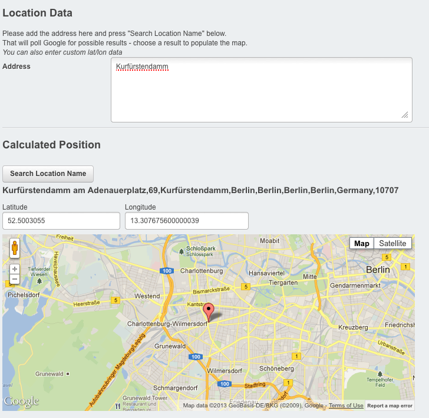

# Mappable Light

_A fork from Uncle Cheese's [Mappable module](https://github.com/unclecheese/Mappable) module, intended to be lightweight._


**NOTE:** This is under active development, so it's a little rusty ad the edges. You're welcome to contribute.


## Requirements

Silverstripe 3

## Installation

As the module is defining a `Mappable` interface, the actual setup can differ from installation to installation. Here is a simple way of getting started with it.


### Model

Implement the `Mappable` interface, example:

```php
class MemberProfile extends DataObject implements Mappable {

	static $db = array (
		'Lat' => 'Varchar',
		'Lon' => 'Varchar'
		'Address' => 'Text' //not strictly required but here it's used for the backend
	);

	/**
	 * Adding the MappableData extension (optional)
	 * Needed to display $StaticMap and $GoogleMap from the frontend
	 */
	static $extensions = array(
		"MappableData"
	);	

/* Mappable interface requirements */

	public function getLatitude() {
		return $this->Lat;
	}

	public function getLongitude() {
		return $this->Lon;
	}

	public function getMapContent() {
		//below is not currently implemented
		//return GoogleMapUtil::sanitize($this->renderWith('MapBubbleMember'));
	}

	public function getMapPin() {
		return $this->Type."_pin.png";
	}

/* end Mappable interface requirements */

}
```

Read more on [Uncle Cheese's blog](http://www.leftandmain.com/silverstripe-tutorials/2011/06/14/new-mappable-module-and-some-unsolicited-programming-pedagogy/)


### Backend

The included `LatlonField` has been taken from [Gordon Anderson](https://github.com/gordonbanderson)'s fork, and amended.    
To my opinion the code needs a restructuring. For now it's working, and has been amended for generating a google map and lat/lon coordinates from a google map.




Here is an example on how the `LatlonField` can be integrated:

```php
public function getCMSFields() {
	$fields = parent::getCMSFields();
	$fields->removeByName('Address');
	$fields->removeByName('Lat');
	$fields->removeByName('Lon');		
	
	$fields->addFieldToTab("Root.Location",
		HeaderField::create('AddressHeading','Location Data')
	);

	$fields->addFieldToTab("Root.Location",
		TextareaField::create('Address')
	);

	$fields->addFieldToTab("Root.Location",
		HeaderField::create('LatLonHeading','Calculated Position')
	);

	$fields->addFieldToTab("Root.Location", new LatLongField(array(
			new TextField('Lat','Latitude'),
			new TextField('Lon','Longitude')
		),
		array('Address')
	));		

	return $fields;
}		
```


## Resources

Other noticeable Mappable forks:    
_For all, see <https://github.com/unclecheese/Mappable/network>_

* <https://github.com/unclecheese/Mappable/tree/v3>
* <https://github.com/gordonbanderson/Mappable>
	* <https://github.com/gordonbanderson/Mappable/tree/dev30>
